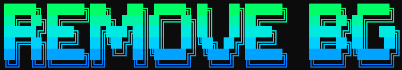

<p align="center">
  
</p>

<p align="center">
  <!-- Version: sửa số sau khi cập nhật VERSION trong banner.py -->
  


 
<a href="https://discord.gg/6Nk3MVWhwk"></a>
  <!-- Ngôn ngữ (ví dụ) -->
  

</p>
---
# 🛠️ Git Helper Tool

Công cụ nhỏ hỗ trợ làm việc với GitHub trong dự án **Remove Background**.  
Mục tiêu: giúp các thành viên dễ dàng **kiểm tra phiên bản** và **push code** theo đúng flow Pull Request, không push trực tiếp vào `main`.

---

## 🚀 Chức năng

### 1. `check_version.cmd`
- Kiểm tra code local so với `origin/main`.
- Nếu code cũ → hỏi Y/N để chạy `git pull`.
- Báo kết quả cập nhật thành công/thất bại.

### 2. `feature_flow.cmd`
- Ngăn push trực tiếp vào `main/master`.
- Nếu đang ở `main/master` → yêu cầu nhập tên nhánh (ví dụ: `feature-them-chuc-nang`).
- Tự động `git add`, `git commit`, `git push`.
- Sau khi push, tự mở trang tạo Pull Request trên GitHub.

---

## 📥 Cài đặt

1. Clone repo:
   ```bash
   git clone https://github.com/KuaaPoH/remove-background.git
2. Đảm bảo đã cài Git: https://git-scm.com/downloads
